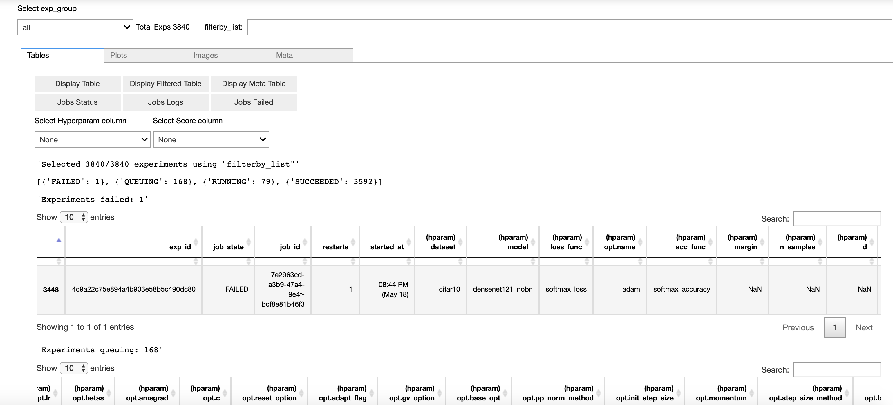

<!-- <table>
    <thead>
        <tr>
            <th style="text-align:center;"></th>
        </tr>
    </thead>
    <tbody>
    </tbody>
</table> -->
[](https://opensource.org/licenses/Apache-2.0)

<h1 align="center">Haven</h1>
<h5 align="center">A workflow for organizing large-scale python experiments. If you have access to the [orkestrator](https://www.elementai.com/products/ork) or slurm, you can run and manage thousands of experiments in parallel.</h5>

Haven is a library for managing and visualizing heavy-scale experiments. It is designed to be simple while still being flexible enough for more complex experimentation workflow. In few steps, Haven helps researchers and developers find the best configuration for their model at large scale.

### Install
```
$ pip install --upgrade git+https://github.com/haven-ai/haven
```


## Table of Contents 

|Section| Description|
|:-------------|:-------------|
|1. [Features](#features)|See the features that Haven can offer.|
|2. [Getting Started](https://github.com/haven-ai/haven/tree/master/getting_started.ipynb)|Start using Haven by following the [Jupyter notebook](https://github.com/haven-ai/haven/tree/master/getting_started.ipynb).|
|3. [Minimal Example](https://github.com/haven-ai/haven/tree/master/examples/minimal)|Check out a minimal example project based on Haven's workflow.|
|4. [Havenized Projects](#havenized-projects)|Check out some projects that are built on Haven.|


<!-- /home/issam/Research_Ground/haven/ -->

## Features


Haven's workflow provides the following features:

#### Easy to adopt:

- Users can make it work in a few minutes

#### Simple to use:

- Users can find the best configuration of hyperparameters for their model using a few lines of code

- Users can quickly debug their code for failed experiments

#### Easy to visualize:

- Users can use Jupyter or Terminal to dynamically interact with the pandas DataFrame and matplotlib plots to compare between results

- Users can use our Jupyter dashboard to have a flexible view of their experiments

- Users can view the status of their launched experiments and their logs.

#### Easy to reproduce results:

- Haven keeps a copy of the code for each running experiment

- Haven keeps a copy of the logs and the control flow for each experiment

#### Backend agnostic:

- Haven can be used in conjunction with any job scheduler to launch experiments such as slurm and the orkestrator

#### Shareable results:

- The results can easily be shared between developers and researchers

#### Production ready:

- Users can integrate Haven in their production pipeline


## Havenized Projects

The following are example projects built using this library.

- [Minimal](https://github.com/haven-ai/haven/tree/master/examples/minimal) - we recommend this example as a starting point for using Haven.
- [Embedding Propagation](https://github.com/ElementAI/embedding-propagation)
- [Counting with LCFCN](https://github.com/ElementAI/LCFCN)
- [Sps optimizer](https://github.com/IssamLaradji/sps)
- [Sls optimizer](https://github.com/IssamLaradji/sls)


## Getting Started

#### 1. Write the codebase

A [minimal](https://github.com/haven-ai/haven/tree/master/examples/minimal) codebase can include the following 4 files. Each of these files is hyper-linked to a template source code.

- [`exp_configs.py`](https://github.com/haven-ai/haven/tree/master/examples/minimal/exp_configs.py) contains experiment groups for MNIST. Below we define two sets of hyper-parameters for experiment group `mnist`.
```python
EXP_GROUPS = {'mnist':
                [{'lr':1e-3, 'model':'mlp', 'dataset':'mnist'},
                 {'lr':1e-4, 'model':'mlp', 'dataset':'mnist'}]}
```
- [`trainval.py`](https://github.com/haven-ai/haven/tree/master/examples/minimal/trainval.py) contains the main training and validation loop for an experiment.
- [`datasets.py`](https://github.com/haven-ai/haven/tree/master/examples/minimal/datasets.py) contains the code for acquiring a Pytorch dataset.
- [`models.py`](https://github.com/haven-ai/haven/tree/master/examples/minimal/models.py) contains the code for acquiring a Pytorch model.

#### 2. Run the Experiments

After writing the codebase, we can run the `mnist` experiment group by following one of the two steps below.

##### 2.1 Run trainval.py in Command Line

The following command launches the mnist experiments and saves their results under `../results/`.

```
python trainval.py -e mnist -sb ../results -r 1
```

##### 2.2 Using the orkestrator

The orkestrator allows us to run all the experiments in parallel. Note that we will be able to view their status and logs using the visualization script in Section 4. To request access to the orkestrator please visit the [orkestrator website](https://www.elementai.com/products/ork).

Define a job configuration  and add it to [`trainval.py`](https://github.com/haven-ai/haven/tree/master/examples/minimal/trainval.py) (see example),

```
job_config = {'data': <data>,
            'image': <docker image>,
            'bid': '1',
            'restartable': '1',
            'gpu': '4',
            'mem': '30',
            'cpu': '2'}
```

Then run the following command,

```
python trainval.py -e mnist -sb ../results -r 1 -j 1
```
The `-j 1` argument launches each experiment in `exp_list` concurrently and a job id is assigned to each experiment. 

#### 3. Visualize the Results

The following two steps will setup the visualization environment.

##### 3.1 Launch Jupyter

Run the following in command line to install a Jupyter server
```bash
jupyter nbextension enable --py widgetsnbextension --sys-prefix
jupyter notebook
```

or if you are working using an open-ssh server, run the following instead,

```
jupyter notebook --ip 0.0.0.0 --port 9123 \
      --notebook-dir="/home/$USER" --NotebookApp.token="password"
```

##### 3.2 Run Jupyter script

Run the following script from a Jupyter cell to launch a dashboard.


```python
from haven import haven_jupyter as hj
from haven import haven_results as hr
from haven import haven_utils as hu

# path to where the experiments got saved
savedir_base = <insert_savedir_base>
exp_list = None

# exp_list = hu.load_py(<exp_config_name>).EXP_GROUPS[<exp_group>]
# get experiments
rm = hr.ResultManager(exp_list=exp_list, 
                      savedir_base=savedir_base, 
                      verbose=0
                     )
# launch dashboard
hj.get_dashboard(rm, vars(), wide_display=True)
```

This script outputs the following dashboard.




### Contributing

We love contributions!
