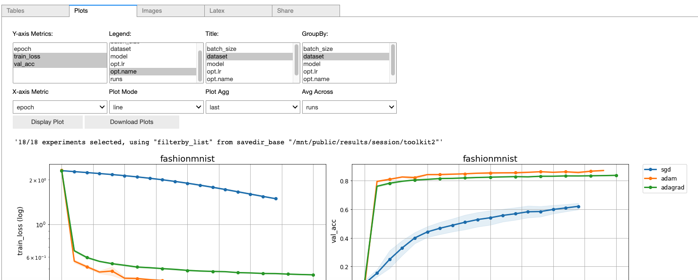

## **Create end-to-end ML benchmarks with the following 4 steps**

### 0 Install
```
pip install --upgrade git+https://github.com/haven-ai/haven-ai
```

### 1 Clone

```
git@github.com:haven-ai/haven-ai.git
```

### 2 Run training and Validation

```
cd haven-ai/demos/live_talk1/
python trainval.py -e mnist -sb ../results -d ../results -r 1 -v results.ipynb
```

### 3 Visualize

Open a notebook for `results.ipynb` and run the first cell to get a dashboard


