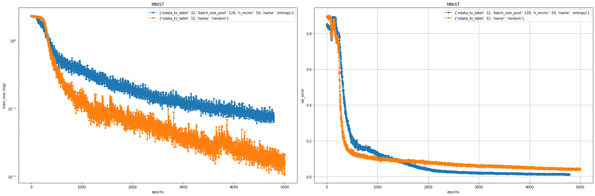

## Active Learning Benchmark

### Quick start

1) Run binary mnist experiments and save their results in <savedir_base>

```
python trainval.py -e mnist_binary -sb <savedir_base> -r 1
```

2) Save the results in a jupyter and plots under `results/`
```
python trainval.py -e mnist_binary -sb <savedir_base> -v 1
```

3) Run binary mnist experiments using the job scheduler

```
python trainval.py -e mnist_binary -sb <savedir_base> -j 1
```


#### Visualizing mnist_full experiment

