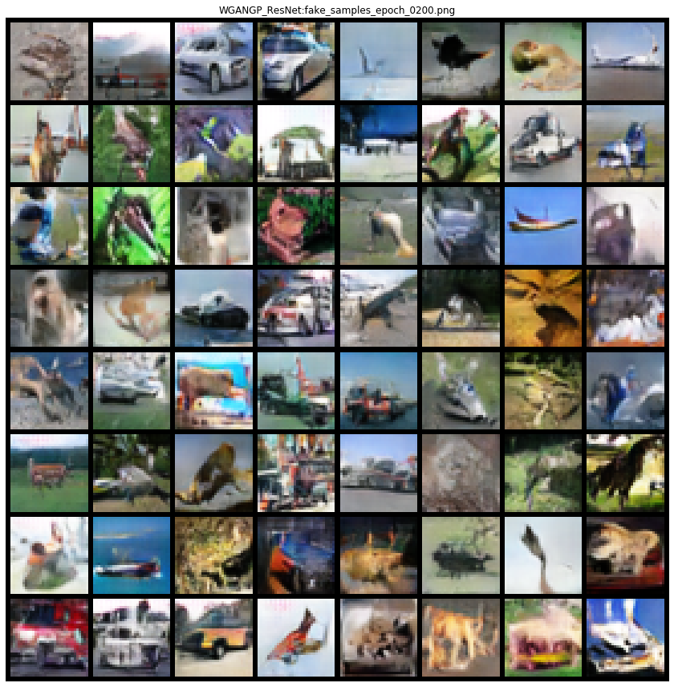

## GANs Benchmark

### Quick start

1) Train a GAN on MNIST and save their results in <savedir_base>

```
python trainval.py -e wgan -sb <savedir_base> -r 1
```


#### Visualizing mnist_full experiment



